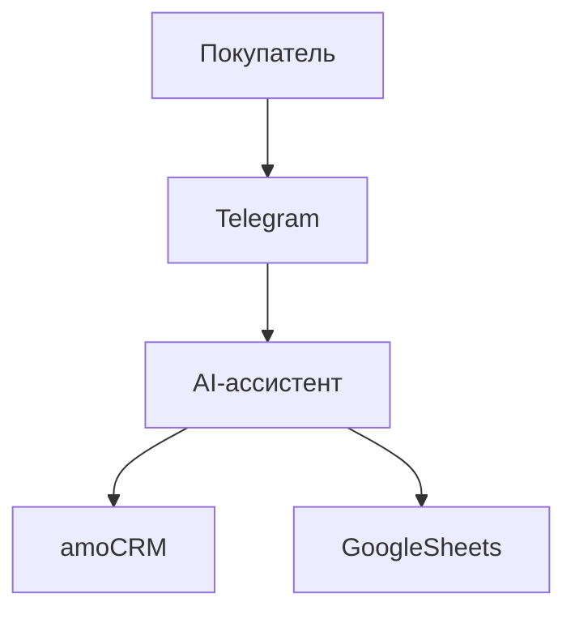
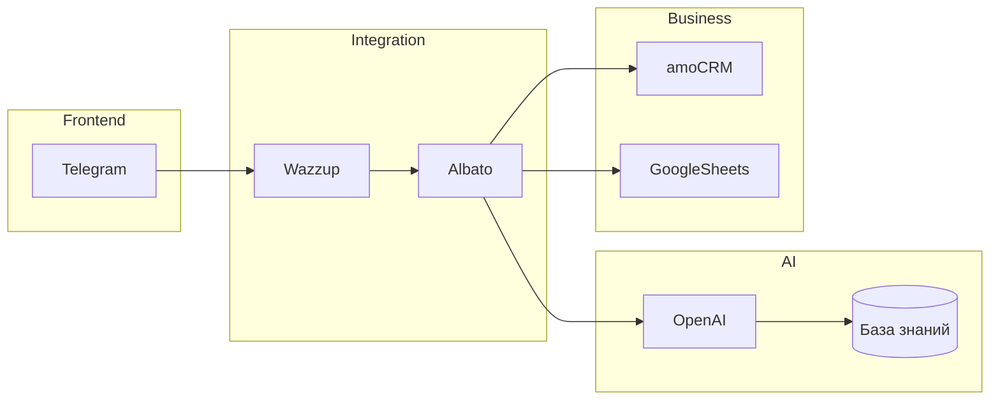

# 🧩 Архитектура системы

## Общая схема

```mermaid
flowchart LR
    Client[Клиент в Telegram] --> Telegram
    Telegram --> Wazzup
    Wazzup --> Albato
    Albato --> OpenAI
    OpenAI --> Albato
    Albato --> amoCRM
    Albato --> GoogleSheets
    Albato --> Webhook
Вот полностью готовый **README.md** — можно копировать и размещать в GitHub.

---

````markdown
# 🏡 AI-ассистент для ЖК «Сияние Ели»

AI-ассистент в Telegram, выполняющий роль менеджера по продажам жилого комплекса «Сияние Ели».

Ассистент:
- консультирует клиентов по недвижимости
- ведёт диалог по строгому сценарию
- выявляет потребности
- квалифицирует лид
- собирает данные
- передаёт заявку в CRM автоматически

---

# 🚀 Бизнес-цель проекта

Автоматизировать первичную обработку входящих обращений:

- 24/7 обработка заявок
- Снижение нагрузки на отдел продаж
- Стандартизация квалификации
- Структурированная передача лидов в amoCRM
- Логирование и аналитика

---

# 🧩 Архитектура системы

## Общая схема

```mermaid
flowchart LR
    Client[Клиент в Telegram] --> Telegram
    Telegram --> Wazzup
    Wazzup --> Albato
    Albato --> OpenAI
    OpenAI --> Albato
    Albato --> amoCRM
    Albato --> GoogleSheets
    Albato --> Webhook
````

---

## 📌 Поток обработки лида

```mermaid
sequenceDiagram
    participant C as Клиент
    participant T as Telegram
    participant W as Wazzup
    participant A as Albato
    participant O as OpenAI Assistant
    participant CRM as amoCRM

    C->>T: Сообщение
    T->>W: Передача
    W->>A: Webhook
    A->>O: Запрос + контекст
    O->>A: Ответ + NEWLEAD JSON
    A->>A: Split по §§§
    A->>CRM: Обновление сделки
    A->>C: Ответ клиенту
```

---

# 🏗 C4 Architecture

## Level 1 — System Context



---

## Level 2 — Containers



---

# 🧠 Логика работы ассистента

Ассистент работает по фазовому сценарию:

1. Интерес к проекту
2. Презентация комплекса
3. Определение цели покупки `{purpose}`
4. Количество комнат `{rooms}`
5. Ипотека `{ipoteka}`
6. Сбор контактов `{name}`, `{phone}`
7. Формирование системного блока NEWLEAD

---

# 📦 Передача данных (NEWLEAD)

В конце диалога ассистент формирует системный JSON-блок:

```json
{
  "trigger": "NEWLEAD",
  "name": "§§§{name}§§§",
  "phone": "§§§{phone}§§§",
  "summarize": "§§§{summarize}§§§",
  "quest": "§§§{quest}§§§",
  "purpose": "§§§{purpose}§§§",
  "rooms": "§§§{rooms}§§§",
  "ipoteka": "§§§{ipoteka}§§§"
}
```

---

# 🔄 Парсинг в Albato

1. Разделение строки по маркеру `§§§`
2. Извлечение позиций массива:

| Позиция | Поле      |
| ------- | --------- |
| 2       | name      |
| 4       | phone     |
| 6       | summarize |
| 8       | quest     |
| 10      | purpose   |
| 12      | rooms     |
| 14      | ipoteka   |

3. Обновление сделки в amoCRM
4. Логирование в Google Sheets
5. Отправка webhook (опционально)

---

# 🗂 Поля amoCRM

| Поле CRM      | Переменная |
| ------------- | ---------- |
| api_name      | name       |
| api_phone     | phone      |
| api_summarize | summarize  |
| api_quest     | quest      |
| api_purpose   | purpose    |
| api_rooms     | rooms      |
| api_ipoteka   | ipoteka    |

---

# 📚 База знаний

Ассистент использует vector store с информацией о:

* концепции ЖК
* инфраструктуре
* транспорте
* ипотечных условиях
* безопасности
* ценах
* процессе покупки

База подключена к OpenAI Assistant через retrieval.

---

# 🛡 Технические особенности

* Жёсткий фазовый сценарий
* Контроль роли (ассистент ≠ пользователь)
* Строгий JSON-формат NEWLEAD
* Маркер `§§§` для стабильного split
* Нормализация телефона (8XXXXXXXXXX → +7XXXXXXXXXX)
* Фильтрация вопросов клиента (в `{quest}` попадают только вопросы пользователя)

---

# 📊 Результат внедрения

* 24/7 обработка входящего трафика
* Сокращение времени ответа
* Структурированные лиды
* Контроль качества коммуникации
* Повышение конверсии

---

# 🔮 Возможности масштабирования

* Подключение дополнительных каналов (WhatsApp, VK, Instagram)
* Расширение базы знаний
* Добавление аналитики в BI
* A/B тестирование сценариев
* Интеграция с рекламными кабинетами

---

# 📌 Стек технологий

* OpenAI Assistant
* Albato
* Wazzup
* amoCRM
* Google Sheets
* Telegram Bot API

---

# 👨‍💻 Автор системы

AI System by Zerocoder & Nikita Shorin
(архитектура автоматизации + AI-интеграции)

```

---

Если нужно, могу дополнительно подготовить:

- версию README для продакшн-репозитория  
- версию для демонстрации инвесторам  
- техническую документацию DevOps  
- схему отказоустойчивости и масштабирования  
- инструкцию по развёртыванию с нуля
```
